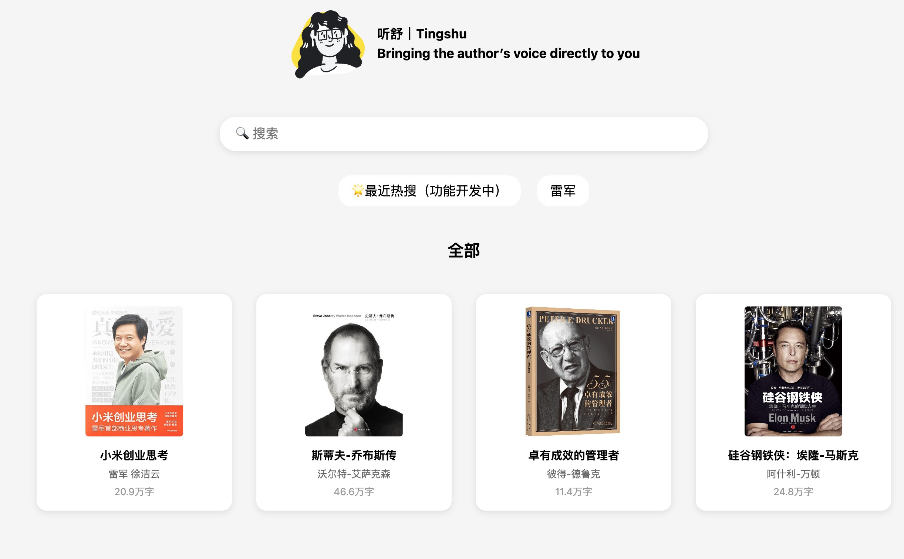

# Tingshu - Listen to the Author

**Tingshu 听舒** ｜ Bringing the author’s voice directly to you

  
  
  
  
  
  
  
  

> Once I was reading Lei Jun’s *Xiaomi: Thoughts on Entrepreneurship* and had an idea. What if we create an audio replica of the author’s narration of the entire book, told in their own voice? This way, we could make it easier to apply the same model to other authors as well—especially autobiographies, where the author’s own voice adds a unique, personal touch.

## Disclaimer

We do not hold any responsibility for any illegal usage of the codebase. Please refer to your local laws about DMCA and other related laws.

## Credits

- [VITS2 (daniilrobnikov)](https://github.com/daniilrobnikov/vits2)
- [Bert-VITS2](https://github.com/fishaudio/Bert-VITS2)
- [GPT VITS](https://github.com/innnky/gpt-vits)
- [GPT-SoVITS](https://github.com/RVC-Boss/GPT-SoVITS)
- [Fish Speech](https://github.com/fishaudio/fish-speech)